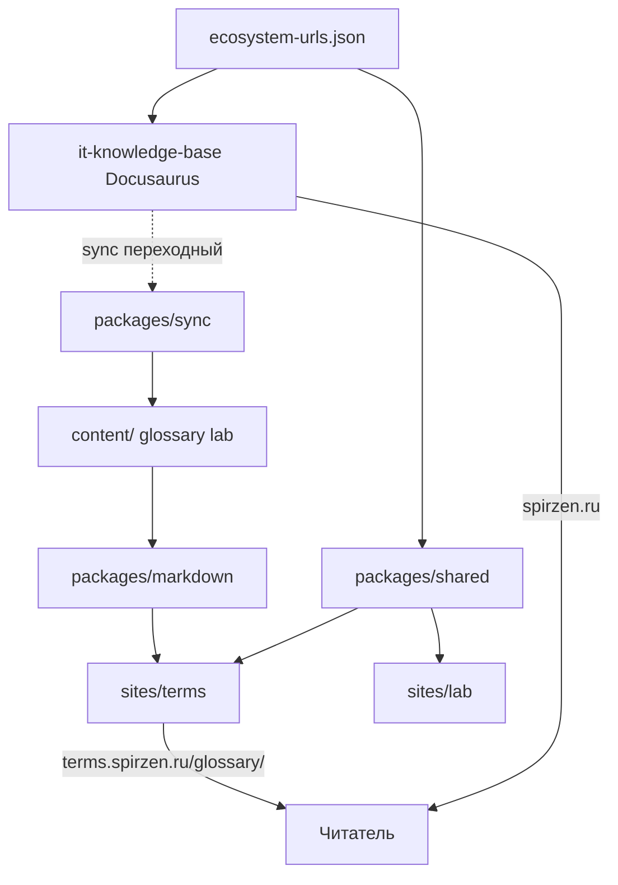

# Архитектура it-portals

> Monorepo Astro-порталов экосистемы «Вселенная IT».  
> Обновлено: **2026-06-27**.

## Назначение

`it-portals` — **тип A** из стратегии экосистемы: лёгкие статические порталы на Astro, контент в `content/`, общий UI в `packages/shared`.  
**Docusaurus остаётся только на spirzen.ru** (энциклопедия).

## Схема



## Репозиторий

```
it-portals/
├── ecosystem-urls.json      # домены, маршруты, nav, postMessage
├── content/                 # markdown (источник правды порталов)
├── packages/
│   ├── shared/              # layout, nav, theme, CSS
│   ├── markdown/            # parse + render glossary/lab MD
│   └── sync/                # копирование из it-knowledge-base
├── sites/
│   ├── terms/               # terms.spirzen.ru — глоссарий
│   ├── lab/                 # lab.spirzen.ru — заготовка
│   ├── games/               # games.spirzen.ru — заготовка
│   ├── kids/                # kids.spirzen.ru — заготовка
│   └── tools/               # tools.spirzen.ru — заготовка
└── docs/                    # документация для агентов и авторов
```

## URL-схема (совместимость с KB)

| Портал | Домен | Путь | Пример |
|--------|-------|------|--------|
| Terms | terms.spirzen.ru | `/glossary/{letter}` | `/glossary/Д#данные` |
| Lab | lab.spirzen.ru | `/lab/...` | (план) |

**Правило:** при миграции меняется **домен**, не path — чтобы wiki-links и закладки легко переводились через `ecosystem-urls.json`.

## ecosystem-urls.json

Единый конфиг для:

- production/local URL всех сервисов;
- префиксов маршрутов (`glossaryPrefix`, `labPrefix`, …);
- пунктов `EcosystemNav`;
- имён postMessage для синхронизации темы (`itu-theme-request`, `itu-theme-change`).

Используется в:

- `packages/shared/src/ecosystem.mjs`;
- (план) `it-knowledge-base/scripts/build-wiki-link-index.mjs` — external glossary base;
- (план) `itu-mobile-app` search manifest.

## Пакеты

### @itu/portal-shared

- `PortalLayout.astro` — shell: nav, sidebar slot, theme FOUC guard;
- `EcosystemNav.astro` — ссылки на spirzen, code, play, …;
- `ThemeToggle.astro` + `theme.js` — light/dark, localStorage, postMessage;
- CSS tokens (фиолетовый акцент terms, отличимый от Docusaurus).

### @itu/portal-markdown

- Парсинг frontmatter (`gray-matter`);
- Удаление Docusaurus-артеfactов (`DocCardList`, `article-tags`, `@site` imports);
- Извлечение терминов из `## заголовков`;
- `loadGlossaryPages()` → данные для Astro `getStaticPaths`.

### @itu/portal-sync

- `sync-glossary.mjs`, `sync-lab.mjs` — mirror из `IT_KB_ROOT/docs/…`;
- **Не** часть prod runtime — только dev/CI/migration.

## Сборка сайта terms

1. `getStaticPaths()` читает `content/glossary/*.md`.
2. Для каждой буквы — страница `/glossary/[slug]`.
3. Sidebar — алфавит + intro.
4. Термины — якоря `#anchor` как в Docusaurus.

Env:

| Переменная | Prod | Local |
|------------|------|-------|
| `IT_TERMS_SITE` | `https://terms.spirzen.ru` | `http://localhost:4330` |
| `IT_TERMS_BASE` | `/` | `/` |
| `IT_PORTALS_DEV=1` | — | подмена URL в nav на localhost |

## Интеграция с it-knowledge-base (план)

1. `build-wiki-link-index.mjs` — glossary href → `https://terms.spirzen.ru/glossary/…`
2. `sidebars.js` — убрать glossary или stub + redirect
3. `@docusaurus/plugin-client-redirects` — `/glossary/*` → terms (meta/stub)
4. `doc-search-index` — glossary только на terms; federated search позже

См. [MIGRATION.md](./MIGRATION.md).

## GitHub Pages

Один репозиторий = **один custom domain** на GitHub Pages.

- **terms.spirzen.ru** → деплой из `sites/terms/dist` (workflow `deploy-terms.yml`).
- Остальные поддомены → отдельные repos **или** Cloudflare Pages (несколько project roots).  
  См. [DEPLOY.md](./DEPLOY.md).

## Локальная разработка

См. [LOCAL-DEV.md](./LOCAL-DEV.md).

## Связанные репозитории

| Repo | Роль |
|------|------|
| it-knowledge-base | Энциклопедия, пока источник glossary/lab для sync |
| it-code-examples | code.spirzen.ru |
| it-play | play.spirzen.ru |
| it-management | (план) кнопки dev/build порталов |
